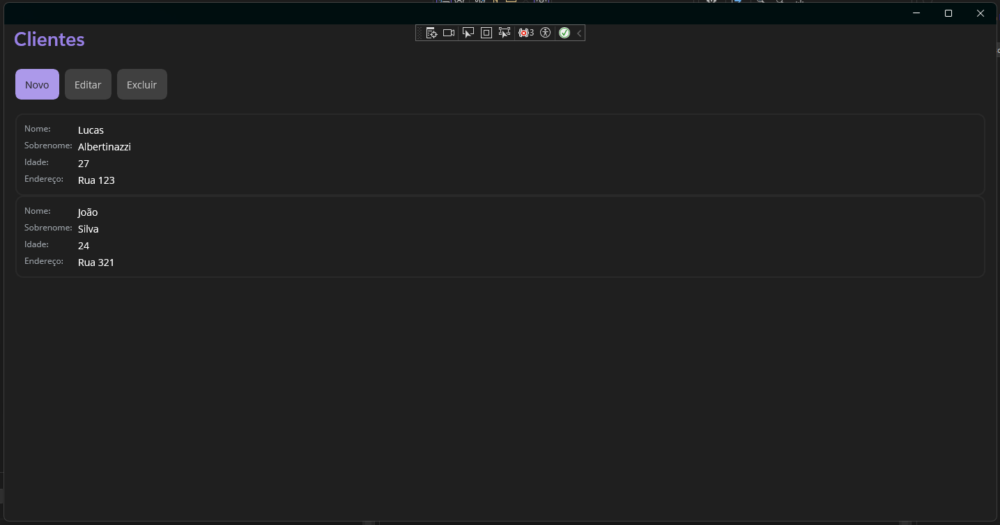

# Teste Técnico CRUD - .NET MAUI

Trata-se de um CRUD de **Clientes**, desenvolvido em **.NET MAUI (.NET 9)** para **Windows**, utilizando o padrão **MVVM**.

---

## ✨ Funcionalidades

- Listagem de clientes na tela principal.  
- Inclusão de novos clientes em uma janela separada.  
- Edição de clientes existentes em uma janela separada.  
- Exclusão de clientes com mensagem de confirmação.  
- Persistência em cache (JSON) para manter os dados mesmo após fechar e reabrir o app.  
- UI estilizada com cards compactos mostrando **Nome, Sobrenome, Idade e Endereço**.  
- Injeção de dependência configurada.
- Verificação dos campos.

---

## ✅ Requisitos atendidos

- Padrão **MVVM** ✔  
- CRUD completo de clientes ✔  
- Injeção de dependência ✔  
- Janelas separadas para inclusão/edição ✔  
- Mensagem de confirmação para exclusão ✔  
- Persistência em cache JSON (opcional do teste) ✔  
- Estilização dos cards ✔

---

## 🖼️ Print da aplicação

_Tela principal com listagem e ações CRUD:_

---

## 🛠️ Tecnologias utilizadas

- [.NET 9](https://dotnet.microsoft.com/)  
- [MAUI](https://learn.microsoft.com/dotnet/maui/)  
- [CommunityToolkit.Mvvm](https://learn.microsoft.com/dotnet/communitytoolkit/mvvm/)  
- C# 12  
- XAML  

---
